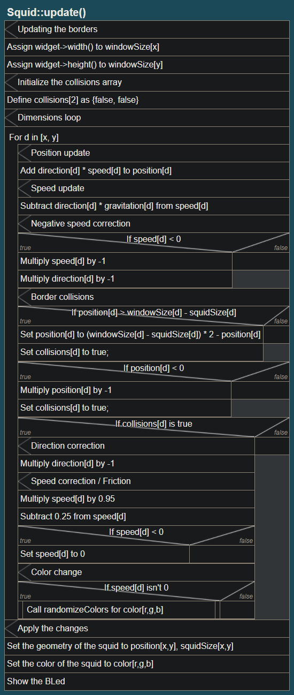

[](school_project?_more_like_rocket_science)

# Squid documentation

## This section covers the following files:
- [squid.h](/squid.h)
- [squid.cpp](/squid.cpp)

------

First, we should take a look at start of the header and the C++ file:

##### From [squid.h](/squid.h)

```h
#include "bled.h"
```

##### From [squid.cpp](/squid.cpp)

```cpp
#include "squid.h"
#include "bled.h"
#include <QColor>
```

Those are the libraries used in the Squid class. And on that note, we should look at the header file, or to be specific, the Squid class definition:

------

##### From [squid.h](/squid.h)

```h
class Squid {
public:
    // the movement, pos and so on
    // [2] = x, y | [3] = r, g, b
    int x = 0; int y = 1;
    int r = 0; int g = 1; int b = 2;
    double speed[2];
    int windowSize[2];
    int squidSize[2];
    int direction[2];
    double position[2];
    int color[3];
    double gravitation[2];
    BLed* led;
    void randomizeColors(int& r, int& g, int& b);
    QWidget *widget;
    void update();
    Squid(QWidget *parent=0);
    ~Squid();
};
```

------

`class Squid { ... }` just declares the class Squid.

------

### (`public`) `int x` | `int y` | `int r` | `int g` | `int b`

To demonstrate why I declared those variables I've made a example:

```cpp
position = [30,50]; // x position, y position
color = [255, 255, 128]; // red value, green value, blue value

// We could do this:
setXPosition(position[0]);
setYPosition(position[1]);
// And this:
setRedValue(color[0])
setGreenValue(color[1])
setBlueValue(color[2])


// But we can also do this:
x = 0; y = 1;
r = 0; g = 1; b = 2;

// And now we can do this:
setXPosition(position[x]);
setYPosition(position[y]);
// And this:
setRedValue(color[r])
setGreenValue(color[g])
setBlueValue(color[b])
```

It's not neccesary, but it just makes the code much cleaner and makess it easier to read.

------

### (`public`) `Squid(QWidget *parent)`

This is the constructor for Squid. The *parent pointer is used to acess the parent / widget.

Note: I'll explain most of the code below in the matching class member explanations.

> To do: Replace `with step=n` with `by n`

##### From [squid.cpp](/squid.cpp)

```cpp
Squid::Squid(QWidget *parent) {

    // Store parent into a var
    widget = parent;

    // Initialize squidSize[x,y] for anything between [20..50] with step=1
    squidSize[x] = squidSize[y] = rand()%31+20;

    // Initialize window size
    windowSize[x] = parent->width();
    windowSize[y] = parent->height();

    // loop: dimension for d in [x,y] (0,1)
    for (int d = x; d <= y; d++) {

        // Initialize speed for anything between [0.5..2.5] with step=0.1
        speed[d] = rand()%21/10+0.5;

        // Initialize direction for anything between [-1..1] with step=2 (-1|1)
        direction[d] = rand()%2*2-1;

        // Initialize position for anything between [0...windowSize[x] - squidSize[x]] with step=1
        position[d] = rand()%(windowSize[d] - squidSize[d]);
    }

    // Initialize color for anything between [25..225] with step=1
    randomizeColors(color[r], color[g], color[b]);

    // Initialize the gravitation values
    gravitation[x] = 0;
    gravitation[y] = -0.1;

    // Create the LED's
    led = new BLed(parent);

    // Call the update function
    update();

}
```

Note the for loop:

##### From [squid.cpp](/squid.cpp)

```cpp
// loop: dimension for d in [x,y] (0,1)
for (int d = x; d <= y; d++) { /* [...] */ }
```

This loops over `x` and `y` and stores it into `d`, short for Dimension. This is used to avoid having to use statements twice with just the dimension changed.

This code basically initializes all the member variables of Squid. The only thing worth noting here is the `update()` at the end, it is used to show the Squid at the beginning. 

------

### (`public`) `double speed[2]`

This is the variable that stores the x and y speed of the squid. It should *always* be positive, and the `direction` variable should be used to set the direction. This is the case because adding n to the speed ifthe current speed is negative will actually *slow down* the speed.

It is defined here:

> To do: Fix int/int division

##### From [squid.cpp](/squid.cpp)

```cpp
// loop: dimension for d in [x,y] (0,1)
for (int d = x; d <= y; d++) { 

    // Initialize speed for anything between [0.5..2.5] with step=0.1
    speed[d] = rand()%21/10+0.5;

    // [...]
}
```

`rand()%21` is used to get a integer with `[0...21]` or `[0..20]`. We divide it by 2 to get `[0..10] by 0.5`. Then we add 0.5 to get `[0.5..10.5] by 0.5`. We do that with every dimension (x and y).

------

### (`public`) `int windowSize[2]`

This is the variable that stores the dimensions of the window.

It isn't defined in the constructor, because it'll get updated in the `update()` function.

It stores the window width and height into the windowSize array.

------

### (`public`) `int squidSize[2]`

This is the variable that stores the dimensions of the squid.

It is defined here:

##### From [squid.cpp](/squid.cpp)

```cpp
// Initialize squidSize[x,y] for anything between [20..50] with step=1
squidSize[x] = squidSize[y] = rand()%31+20;
```

`rand()%31` is used to get a integer with `[0...31]` or `[0..30]`. We add 20 to get `[20...50]`. We do that once and store it into both variables to make the LED round.

------

### (`public`) `int direction[2]`

This is the variable that stores the x and y direction of the squid.

Note that this isn't supposed to be a speed variable, but the direction. The `update()` function uses `position += speed * direction`. `direction` should be -1 or 1.

It is defined here:

##### From [squid.cpp](/squid.cpp)

```cpp
// loop: dimension for d in [x,y] (0,1)
for (int d = x; d <= y; d++) {
    // [...]

    // Initialize direction for anything between [-1..1] with step=2 (-1|1)
    direction[d] = rand()%2*2-1;

   // [...]
}
```

`rand()%2` is used to get a integer with `[0...2]` or `[0..1]`. We multiply it by 2 to get `[0..2] by 2` and then we subtract 1 to get `[-1..1] by 2` or `(-1|1)`. We do that with every dimension (x and y).

------

### (`public`) `double position[2]`

This is the variable that stores the x and y position of the squid.

It is defined here:

##### From [squid.cpp](/squid.cpp)

```cpp
// loop: dimension for d in [x,y] (0,1)
for (int d = x; d <= y; d++) {
    // [...]

    // Initialize position for anything between [0...windowSize[x] - squidSize[x]] with step=1
    position[d] = rand()%(windowSize[d] - squidSize[d]);
}
```

You might notice the `windowSize-squidSize` there. We need to do that because the squid could spawn out of the borders, or inside of the border. To make this more clear here's a visualisation:
###### [(Direct image link)](/docs/img/sizesubtraction.png)


We use `rand()%[maxPos]` to get a value that's still in the borders.

------

### (`public`) `int color[3]`

This variable is used to store the color of the squid.

It is defined here:

##### From [squid.cpp](/squid.cpp)

```cpp
randomizeColors(color[r], color[g], color[b]);
```

The `randomizeColors()` function is explained later.

------

### (`public`) `BLed* led`

This is the variable that stores the BLed.

It is defined here:

##### From [squid.cpp](/squid.cpp)

```cpp
led = new BLed(parent);
```

------

### (`public`) `void randomizeColors(int& r, int& g, int& b)`

This is the function which is used to randomize colors. I made this into a seperate function because it might be called in the future outside of the costructor.

We are passing the `r`, `g`, and `b` variables as references to modify the colors by using the reference operator `&`.

The function body is very simple:

##### From [squid.cpp](/squid.cpp)

```cpp
r = rand()%201+25;
g = rand()%201+25;
b = rand()%201+25;
```

It just assigns values with `[25...226]` or `[25..225]` to the color variables.

------

### (`public`) `~Squid()`

This is the deconstructor. I think the comment says everything that needs to be said:

##### From [squid.cpp](/squid.cpp)

```cpp
Squid::~Squid() {
    // do we really need this? nah
}
```

------

### (`public`) `void update()`

This is the update function which should be called every single frame. 

It does these main things:

- Update the window size
- For each dimension:
    - Move the squid.
    - Apply the gravitation.
        - If the gravitation sets the speed to a negative value, change the direction.
    - Check for collisions with the borders.
        - If it collides, move it back into the box,
        - change the direction,
        - apply friction,
        - and check if the speed is below 0.
            - If yes, set the speed to 0,
        - Then check if the speed isn't 0.
            - If it isn't, change the color.
- Then we show the updated squid.

------

### Window size changes

First we need to check if the window size got changed. This is simple, because we just need to store the current window size in `windowSize`:

##### From [squid.cpp](/squid.cpp)

```cpp
// update borders
windowSize[x] = widget->width();
windowSize[y] = widget->height();
```

------

### The `collisions` variable

Now we declare a local variable called collisions, and set it to false. We will come back to this later.

##### From [squid.cpp](/squid.cpp)

```cpp
// init collisions array
bool collisions[2] = {false, false};
```

-----

### Looping through dimensions

This might sound pretty complicated, but its fairly simple. We just need to do a for loop that loops though x and y. We can use a simple for loop template, because x and y are actually just aliases for 0 and 1.

```cpp
for (int i = firstItem; i <= lastIncludedItem; i++) { /* [...] */ }
```

Now we just have to fill in the variables. And now it looks like this:

##### From [squid.cpp](/squid.cpp)

```cpp
// loop: dimension for d in [x,y] (0,1)
for (int d = x; d <= y; d++) { /* [...] */ }
```

> Note: If you see the variable `d`used, it's a reference to this.

------

### Moving the squid
To move the squid, we can use a simple formula:

```
position = position + direction * speed
```

We can shorten that into this:

```
position += direction * speed
```

Now we just need to put that into the loop for every dimension, and we are good to go.

##### From [squid.cpp](/squid.cpp)

```cpp
// pos update
position[d] += direction[d] * speed[d];
```

------

### Applying the gravitation

Applying the gravitation itself is easy. We just have to use this formula on every update:

```
movement = movement - gravitation
```

Now you might notice that we don't have a gravitation value, but that's also a easy fix.

```
speed = speed - direction * gravitation
```

Now we just need to shorten it and we're good to go.

##### From [squid.cpp](/squid.cpp)

```cpp
// speed update
speed[d] -= direction[d] * gravitation[d];
```

But if we just do that, we'll run into a problem: This can set `speed` to a negative value.

------

###### Fixing negative speeds

To fix a negative speed value, we just have to invert `speed` and `direction`.

##### From [squid.cpp](/squid.cpp)

```cpp
// negative speed correction
if (speed[d] < 0) { 
    speed[d] *= -1; 
    direction[d] *= -1; 
}
```

------

### Collision detection

There are 2 if clauses for the dimensions. The first one might seem a little bit confusing, but it's actually pretty simple.

```cpp
if (position > windowSize - squidSize) {...}
if (position <= 0) {...}
```

To understand why we should do `windowSize - squidSize` we should take a look at this:

###### [(Direct image link)](/docs/img/sizesubtraction.png)


The size needs to be subtracted from the border to make the whole squid collide with the walls, and not just the top left corner, a.k.a the position. Now that we have the collision, we can do something to avoid the squid going off-screen.

For easier collision handling, I've implemented the `collisions` array, which gets checked later.

The loops look like this now:

##### From [squid.cpp](/squid.cpp)

```cpp
// border collision for pos = windowsize
if (position[d] > windowSize[d] - squidSize[d]) {
    // [...]
    collisions[d] = true;
}
```

##### From [squid.cpp](/squid.cpp)

```cpp
// border collision for pos = 0
if (position[d] < 0) {
    // [...]
    collisions[d] = true;
}
```

------

### Moving the squid into the box again

This is super easy for postion <= 0. We can just invert the value, and we're good to go.

##### From [squid.cpp](/squid.cpp)

```cpp
// border collision for pos = 0
if (position[d] < 0) {
    position[d] *= -1;
    // [...]
}
```
The other end of the box is a bit harder though. We have 2 things that weren't a problem before:

- We can't just do `*= -1` because that'd just move it out of the bounds again
- We need to compensate the squid size (see [Collision detection](#collision-detection))

We can just solve this step-by-step.

To move the squid the same way we did it with the -1 we can use this formula: 

```
position = windowSize * 2 - position
```

This might seem a bit weird, but its pretty obvious if we draw it:


```
<---------WindowSize---------->
|                             |
--------------Position---------->   [Out of the borders!]
|                             |
<---------WindowSize---------->
```
```
<---------WindowSize----------><---------WindowSize---------->
|                             |                              |
|                           <--------------Position-----------
|                             |
<---------WindowSize---------->
```

Now we just have to subtract the squid size (see [Collision detection](#collision-detection)), and we're good to go. We can do this like that: 

```
position = (windowSize - squidSize) * 2 - position
```

And we're done!


##### From [squid.cpp](/squid.cpp)

```cpp
// border collision for pos = windowsize
if (position[d] > windowSize[d] - squidSize[d]) {
    position[d] = (windowSize[d] - squidSize[d]) * 2 - position[d];
    // [...]
}

// border collision for pos = 0
if (position[d] < 0) {
    position[d] *= -1;
    // [...]
}
```

------

### Changing the direction

This is super easy. We just need to do `direction *= -1` for the matching dimension.

##### From [squid.cpp](/squid.cpp)

```cpp
// border collision corrections and other stuff
if (collisions[d]) {

    // direction correction
    direction[d] *= -1;

    // [...]
}
```
------

### Applying friction

We only need three statements for this:

- Subtract a relative amount of speed.
- Subtract a absolute amount of speed.
- If the speed is below zero:
    - Set the speed to zero.

Applying that in the code is easy:

##### From [squid.cpp](/squid.cpp)

```cpp
// border collision corrections and other stuff
if (collisions[d]) {
    // [...]

    // speed correction
    speed[d] *= 0.95;
    speed[d] -= 0.25;
    if (speed[d] < 0) speed[d] = 0;

    // [...]
}
```

------

### Changing the color

To change the color, we can just call `randomizeColors()` if the collision detection triggered.

We can update the update function now:

##### From [squid.cpp](/squid.cpp)

```cpp
// border collision corrections and other stuff
if (collisions[d]) {
    // [...]

    // color change
    if (speed[d] != 0) {
        randomizeColors(color[r], color[g], color[b]);
    }
}
```

------

### Applying / showing the changes

This is done with 3 statements that don't really need much explanation:

##### From [squid.cpp](/squid.cpp)

```cpp
led->setGeometry(
    position[x],position[y],
    squidSize[x],squidSize[y]
);
led->setColor(QColor(
    color[r], color[g], color[b]
));
led->show();
```
------

The whole update function now looks like this:

##### From [squid.cpp](/squid.cpp)

```cpp
void Squid::update() {

    // update borders
    windowSize[x] = widget->width();
    windowSize[y] = widget->height();

    // init collisions array
    bool collisions[2] = {false, false};

    // loop: dimension for d in [x,y] (0,1)
    for (int d = x; d <= y; d++) {
        // Position

        // pos update
        position[d] += direction[d] * speed[d];

        // Speed

        // speed update
        speed[d] -= direction[d] * gravitation[d];

        // negative speed correction
        if (speed[d] < 0) { 
            speed[d] *= -1; 
            direction[d] *= -1; 
        }

        // Border collision

        // border collision for pos = windowsize
        if (position[d] > windowSize[d] - squidSize[d]) {
            position[d] = (windowSize[d] - squidSize[d]) * 2 - position[d];
            collisions[d] = true;
        }

        // border collision for pos = 0
        if (position[d] < 0) {
            position[d] *= -1;
            collisions[d] = true;
        }

        // border collision corrections and other stuff
        if (collisions[d]) {

            // direction correction
            direction[d] *= -1;

            // speed correction
            speed[d] *= 0.95;
            speed[d] -= 0.25;
            if (speed[d] < 0) speed[d] = 0;

            // color change
            if (speed[d] != 0) {
                randomizeColors(color[r], color[g], color[b]);
            }
        }
    }

    // Apply the changes
    led->setGeometry(
        position[x],position[y],
        squidSize[x],squidSize[y]
    );
    led->setColor(QColor(
        color[r], color[g], color[b]
    ));
    led->show();
}
```

And here's the whole update function as a structogram:



------

###### Last documented commit: [a9e092](https://github.com/lxhom/schule-squid/commit/a9e092440423be1a77a010e0b78631c0eaa32cb3)